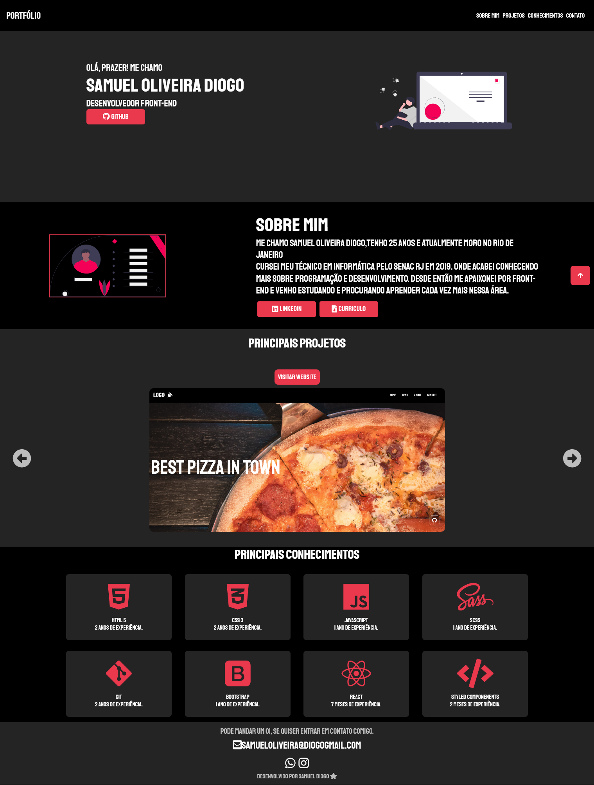

<h1 align="center"> Olá! Esse é meu Portfólio </h1>

<h3 align="center">Portfólio criado com o intuito de mostrar meus projetos ao decorrer da minha carreira.</h3>Se curtiu meu gitHub, já aproveita e me segue! Espero poder te ajudar com meus códigos. Valeu abraços!!</h3>

## Sobre o PROJETO
- **PROJETO FEITO EM REACT.**

### Seções
- Sobre mim: Nessa seção tenho uma breve descrição dizendo um pouco sobre mim;
- Projetos: Apresenta alguns projetos desenvolvidos e com link direto para ve-los em funcionameto;
- Conhecimentos: Nele apresento meus principais conhecimentos em algumas linguagens como o foco no front-end;
- Contato: coloco a disposição meios de poder comunicação comigo.

